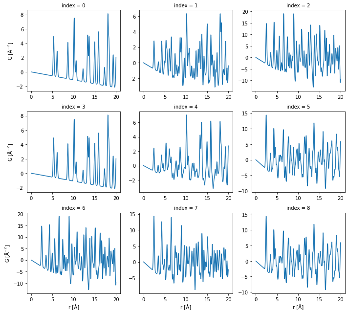
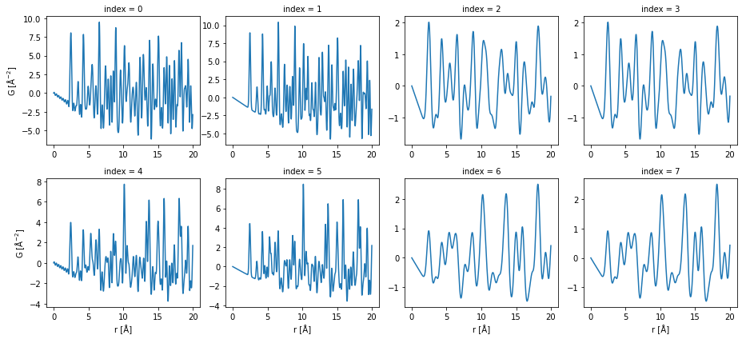

Usage of the CLI
================

Introduction
------------

Simulation of mixture PDFs
~~~~~~~~~~~~~~~~~~~~~~~~~~

The core functionality of the CLI is to generate a folder of PDF data
files from a folder of CIF files. The PDFs are the linear combination of
PDFs calculated from individual CIF files. The coefficients are
calculated according to the molar fractions provided by the user. The
calculation is done in a four layer loop: for each combination of the
CIF files, for each set of the molar fractions, for each set of
calculation settings, for each set of structure parameter settings, a
PDF will be calculated. This PDF is a simulated PDF of the mixture of
phases at certain condition. If the combination only contains one file,
then this PDF is a simulated PDF from a single phase.

Input and output files
~~~~~~~~~~~~~~~~~~~~~~

The input files should all be in one folder. They should be in CIF
format. Below is an example of the files that we will use. Here, the
``!`` means this line runs in a bash shell.

.. code:: ipython3

    ! ls "./cifs"

.. parsed-literal::

    Cs.cif Fe.cif Ni.cif

The output files will be in one folder specified by the user. They are
NETCDF files. Theses files can be read by
`xarray <http://xarray.pydata.org/en/stable/>`__ module. They contain
the PDF data and the settings used to calculate the PDF.

Configuration
~~~~~~~~~~~~~

The fractions to use, the calculation settings and the structure
settings are the key configuration for the simulation. The configuration
is defined in key values pairs, where each key a parameter and each
value is a list of numbers. Because it is assumed multiple values will
be used in the calculation, the numbers for one parameter are stored in
a list. Below shows the default configuration of the calculation. In
default, one “mixture” contains one phase (one CIF file) so it is a
single phase PDF calculation.

.. code:: ipython3

    ! pdfmix show

.. parsed-literal::

    {'delta1': [0.0],
     'delta2': [0.0],
     'fracs': [[1.0]],
     'ftype': 'molar',
     'iso_adp': [0.006],
     'lat_scale': [1.0],
     'qbroad': [0.0],
     'qdamp': [0.0],
     'qmax': [0.0],
     'qmin': [0.0],
     'rmax': [20.0],
     'rmin': [0.0],
     'rstep': [0.01],
     'verbose': 1}

Help
~~~~

To know the syntax of the CLI, simple run the command below.

.. code:: ipython3

    ! pdfmix create -- --help

.. parsed-literal::

    NAME
        pdfmix create - Create mixture PDFs using a collection of crystal structures.

    SYNOPSIS
        pdfmix create OUTPUT_DIRECTORY <flags>

    DESCRIPTION
        The core functionality of the CLI is to generate a folder of PDF data files from a folder of CIF files.
        The PDFs are the linear combination of PDFs calculated from individual CIF files. The coefficients are
        calculated according to the molar fractions provided by the user. The calculation is done in a four layer
        loop: for each combination of the CIF files, for each set of the molar fractions, for each set of
        calculation settings, for each set of structure parameter settings, a PDF will be calculated. This PDF is a
        simulated PDF of the mixture of phases at certain condition. If the combination only contains one file,
        then this PDF is a simulated PDF from a single phase. The input files should all be in one folder. They
        should be in CIF format. The output files will be in one folder specified by the user. They are NETCDF files.
        The fractions to use, the calculation settings and the structure settings are the key configuration for the
        simulation. The configuration is defined in key values pairs, where each key a parameter and each value is a
        list of numbers. Because it is assumed multiple values will be used in the calculation, the numbers for one
        parameter are stored in a list. Below shows the default configuration of the calculation. In default, one
        "mixture" contains one phase (one CIF file) so it is a single phase PDF calculation.

    POSITIONAL ARGUMENTS
        OUTPUT_DIRECTORY
            The output directory location.

    FLAGS
        --input_directory=INPUT_DIRECTORY
            The input directory location, default "./".
        --config_file=CONFIG_FILE
            The configuration yaml file location, if None, don't use it, default None.
        --output_pattern=OUTPUT_PATTERN
            The output file name pattern in the python format string style, default r"{:d}.nc".
        --input_pattern=INPUT_PATTERN
            The input file name pattern in the glob pattern style, used in searching, default r"[!.]*.cif".
        Additional flags are accepted.
            The configuration to update.

    NOTES
        You can also use flags syntax for POSITIONAL ARGUMENTS

Use case: create single phase PDFs
----------------------------------

We use the same data folder for all the use cases demonstrate here.

.. code:: ipython3

    ! ls "./cifs"

.. parsed-literal::

    Cs.cif Fe.cif Ni.cif

The line below shows how to calculate PDFs from a folder “./cifs” of CIF
files using the default configuration and save the results in the
“./pdfs1” folder.

.. code:: ipython3

    ! pdfmix create "./pdfs1" "./cifs" --iso_adp="[0.006]"

.. parsed-literal::

    Find 3 files in the input directory. Choose 1 files to create a mixture phase. For each mixture, there are 1 sets of fractions, 1 structure parameter sets, 1 calculation parameter sets. In total, there are 3 PDFs to calculate.
    Progress: 100%|███████████████████████████████████| 3/3 [00:00<00:00,  7.03it/s]

The line below lists the generated PDF data files. There are three
files, corresponding to the PDFs from “Cs.cif”, “Fe.cif”, “Ni.cif”.

.. code:: ipython3

    ! ls "./pdfs1"

.. parsed-literal::

    0.nc 1.nc 2.nc

In python, we load the one PDF data file and show what are inside the
`xarray.Dataset <http://xarray.pydata.org/en/stable/generated/xarray.Dataset.html>`__.

.. code:: ipython3

    import xarray as xr

    ds0 = xr.load_dataset("./pdfs1/0.nc")
    print(ds0)

.. parsed-literal::

    <xarray.Dataset>
    Dimensions:    (phase: 1, r: 2000)
    Coordinates:
      * r          (r) float64 0.0 0.01 0.02 0.03 0.04 ... 19.96 19.97 19.98 19.99
      * phase      (phase) int32 0
    Data variables:
        G          (r) float64 0.0 -0.001102 -0.002204 ... 1.611 1.825 2.021
        structure  (phase) object "# generated using pymatgen\ndata_Cs\n_symmetry...
        fname      (phase) object 'Cs'
        fraction   (phase) float64 1.0
        iso_adp    float64 0.006
        lat_scale  float64 1.0
        rmin       float64 0.0
        rmax       float64 20.0
        rstep      float64 0.01
        qmin       float64 0.0
        qmax       float64 0.0
        qdamp      float64 0.0
        qbroad     float64 0.0
        delta1     float64 0.0
        delta2     float64 0.0

We visualize the PDF data here.

.. code:: ipython3

    ds = xr.concat(
        [xr.load_dataset("./pdfs1/{}.nc".format(i)) for i in range(3)],
        dim="index"
    )
    ds["G"].plot(col="index", sharex=False, sharey=False);

.. image:: _static/usage_cli_18_0.png

Use case: create the mixture PDFs
---------------------------------

We will use the same folder as the input.

.. code:: ipython3

    ! ls "./cifs"

.. parsed-literal::

    Cs.cif Fe.cif Ni.cif

This time, we will give the parameters for the molar fractions of two
phases. There are three different sets of fractions, where each set
contains two parameters. At each time, we will choose two cif files as
the two phases. In this example, the combinations are “Cs + Fe”, “Cs +
Ni” and “Fe + Ni”. For each combination, we will set the fractions of
phases to be “1:0”, “0.5:0.5” and “0:1” once a time and calculate the
PDF. Then, there should be 9 PDF calculated in total.

.. code:: ipython3

    ! pdfmix create "./pdfs2" "./cifs" --fracs="[[1.0, 0.0],[0.5,0.5],[0.0,1.0]]"

.. parsed-literal::

    Find 3 files in the input directory. Choose 2 files to create a mixture phase. For each mixture, there are 3 sets of fractions, 1 structure parameter sets, 1 calculation parameter sets. In total, there are 9 PDFs to calculate.
    Progress: 100%|███████████████████████████████████| 9/9 [00:01<00:00,  8.52it/s]

Here, we show the PDFs. Each row is a combination of phase and each
column is a set of molar fractions.

.. code:: ipython3

    ds = xr.concat(
        [xr.load_dataset("./pdfs2/{}.nc".format(i)) for i in range(9)],
        dim="index"
    )
    ds["G"].plot(col="index", sharex=False, sharey=False, col_wrap=3);

Use case: create mixture PDFs using different parameters
--------------------------------------------------------

We still use the same folder as the input.

.. code:: ipython3

    ! ls "./cifs"

.. parsed-literal::

    Cs.cif Fe.cif Ni.cif

This time, we calculate the mixture of all three phases using two
different sets of molar fractions and for each set, we will use
different “is_adp” and “qmax”. There are two “iso_adp” and two “qmax” to
use. In total, we will have 2 :math:`\times` 2 :math:`\times` 2 = 8
PDFs.

.. code:: ipython3

    ! pdfmix create "./pdfs3" "./cifs" --fracs="[[0.2,0.6,0.2],[0.4,0.2,0.4]]" --iso_adp="[0.004,0.036]" --qmax="[20.0,40.0]"

.. parsed-literal::

    Find 3 files in the input directory. Choose 3 files to create a mixture phase. For each mixture, there are 2 sets of fractions, 2 structure parameter sets, 2 calculation parameter sets. In total, there are 8 PDFs to calculate.
    Progress: 100%|███████████████████████████████████| 8/8 [00:01<00:00,  6.04it/s]

Here, we show the PDFs. One row is the a combination of molar fractions.
Each column is a combination of the “iso_adp” and “qmax” parameters.

.. code:: ipython3

    ds = xr.concat(
        [xr.load_dataset("./pdfs3/{}.nc".format(i)) for i in range(8)],
        dim="index"
    )
    ds["G"].plot(col="index", col_wrap=4, sharex=False, sharey=False);

Use case: use configuration file
--------------------------------

If there are a long list of the parameters, it will be inconvenient to
type the arguments. We can dump the parameters in a YAML file and use
the file as the configuration interface. To get one file to start, we
run the command below. A file of default configuration will be
generated.

.. code:: ipython3

    ! pdfmix write "pdfmix.yaml"

Here we show what are in this file. We can add or delete the values
inside to create our own configuration.

.. code:: ipython3

    ! cat "pdfmix.yaml"

.. parsed-literal::

    verbose: 1
    fracs:
    - - 1.0
    ftype: molar
    iso_adp:
    - 0.006
    lat_scale:
    - 1.0
    rmin:
    - 0.0
    rmax:
    - 20.0
    rstep:
    - 0.01
    qmin:
    - 0.0
    qmax:
    - 0.0
    qdamp:
    - 0.0
    qbroad:
    - 0.0
    delta1:
    - 0.0
    delta2:
    - 0.0

We provide the path to the YAML file in the argument and run the
command. Here, in this example, we didn’t change any parameters.

.. code:: ipython3

    ! pdfmix create "./pdfs4" "./cifs" --config_file="./pdfmix.yaml"

.. parsed-literal::

    Find 3 files in the input directory. Choose 1 files to create a mixture phase. For each mixture, there are 1 sets of fractions, 1 structure parameter sets, 1 calculation parameter sets. In total, there are 3 PDFs to calculate.
    Progress: 100%|███████████████████████████████████| 3/3 [00:00<00:00,  8.78it/s]

As we expect, the results are the same as the first run we made in the
first use case.

.. code:: ipython3

    ds = xr.concat(
        [xr.load_dataset("./pdfs4/{}.nc".format(i)) for i in range(3)],
        dim="index"
    )
    ds["G"].plot(col="index", sharex=False, sharey=False);

.. image:: _static/usage_cli_41_0.png

We can use the configuration file together with the parameters in
arguments. The priority of which source to use is “values in parameter
arguments” > “values in yaml file” > “default values”.
